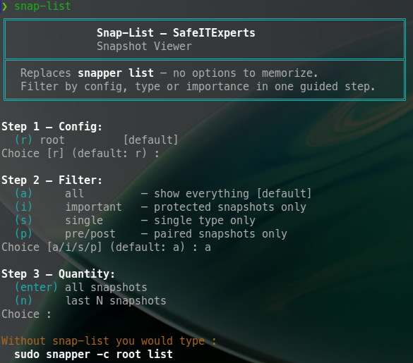
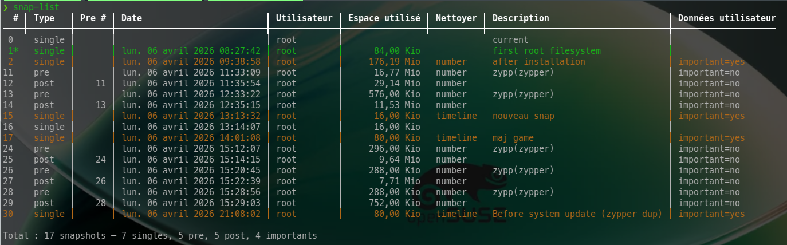
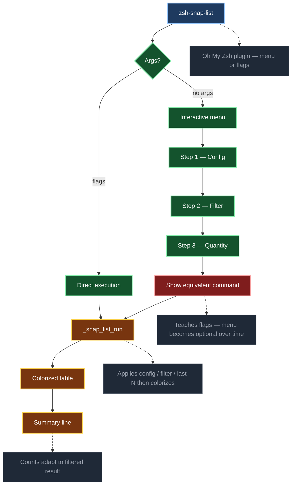

[](https://github.com/crisis1er/zsh-snap-list)


# zsh-snap-list

`sudo snapper list` outputs a raw monochrome table. Every row looks the same — no visual distinction between the active snapshot, protected ones, or routine entries. Filtering requires piping to `grep` or `tail`, which breaks the table header. Viewing root and home requires two separate commands. There is no summary line.

`snap-list` replaces all of this with a **3-step guided menu** — no options to memorize, no pipes, no syntax. The output is colorized, the summary adapts to the active filter, and after each menu session the equivalent raw `snapper` command is shown so you see exactly what you saved yourself from typing.

Deployed and validated on a live openSUSE Tumbleweed system.

---

## Screenshots

### Step 1 — Guided menu: config, filter, quantity

No snapper knowledge required. Three choices and you're done.



### Step 2 — Colorized result with summary line

Green: active snapshot. Yellow: `important=yes` — protected from automatic cleanup. Summary line counts everything at a glance.



---

## Usage

### Interactive menu — type `snap-list` with no argument

A 3-step guided flow selects config, filter, and quantity. After selection, the **equivalent command is shown** so you learn the flags naturally.

```
╔══════════════════════════════════════════════════════════════╗
║              Snap-List — SafeITExperts                       ║
║              Snapshot Viewer                                 ║
╚══════════════════════════════════════════════════════════════╝

Step 1 — Config:
  (r) root         [default]
  (h) home
  (a) all — root + home
Choice [r/h/a] (default: r) :

Step 2 — Filter:
  (enter) none        — show all
  (i)     important   — protected snapshots only
  (s)     single      — single type only
  (p)     pre/post    — paired snapshots only
Choice :

Step 3 — Quantity:
  (enter) all snapshots
  (n)     last N snapshots
Choice :

→ Equivalent command : snap-list -a -i -n 5
```

### Flag mode — direct execution

Once you know the flags, skip the menu entirely:

```zsh
snap-list                        # interactive menu
snap-list -a                     # root + home
snap-list -i                     # important snapshots only
snap-list -t single              # single type only
snap-list -t pre_post            # pre and post only
snap-list -n 5                   # last 5 snapshots
snap-list -c home                # home config
snap-list -h                     # help
```

### Combining flags

```zsh
snap-list -a -i                  # all configs, important only
snap-list -n 10 -t single        # last 10 singles
snap-list -c home -i -n 5        # last 5 importants on home
snap-list -a -t pre_post         # all pre/post on all configs
```

Each combination that would require multiple commands or pipes with raw snapper runs here in a single call, with colorization and summary intact.

---

## Features

### Interactive 3-step menu
Config → Filter → Quantity. The equivalent flag command is printed at the end — the menu teaches itself out of existence.

### Colorized output
| Color | Meaning |
|-------|---------|
| **Green** | Active snapshot — currently mounted (`*`) |
| **Yellow** | Protected — `important=yes`, exempt from automatic cleanup |
| **Bold** | Header lines |
| Default | Standard snapshots |

### Multi-config view (`-a`)
Displays root and home sequentially with a config separator. Requires two separate `snapper` commands otherwise.

### Filtered summary line
The summary adapts to whatever filter is active:
```
Total : 4 snapshots — 4 singles, 0 pre, 0 post, 4 importants
```

### Empty result guard
When no snapshot matches the criteria, a clear message is shown instead of a blank table.

### Inline help (`-h`)
```zsh
snap-list -h
```

---

## Architecture



---

## Requirements

- openSUSE Tumbleweed
- zsh 5.9+
- [Oh My Zsh](https://ohmyz.sh/)
- `snapper` — `sudo zypper install snapper`
- Snapper configured with at least one config (`root`, optionally `home`)

---

## Installation

```zsh
git clone https://github.com/crisis1er/zsh-snap-list \
  ${ZSH_CUSTOM:-~/.oh-my-zsh/custom}/plugins/snap-list
```

Add `snap-list` to the plugins list in `~/.zshrc`:

```zsh
plugins=(... snap-list)
```

Reload:

```zsh
source ~/.zshrc
```

---

## Design decisions

- **Menu mode + flag mode** — guided for discovery, flags for speed once learned
- **Equivalent command display** — the menu teaches itself away; users graduate to flags naturally
- **`_snap_list_run` internal function** — clean separation between UI and execution logic
- **Filters applied before colorization** — ANSI codes never interfere with grep patterns
- **`function name { }` syntax** — prevents zsh alias/function conflicts on shell reload
