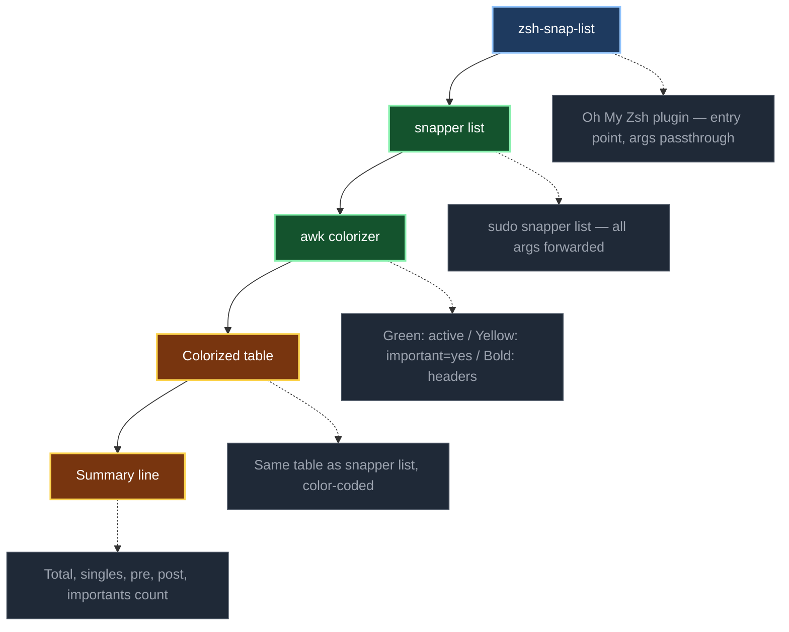

[](https://github.com/crisis1er/zsh-snap-list)


# zsh-snap-list

`sudo snapper list` outputs a raw table — all rows look identical, making it hard to spot what matters at a glance: which snapshot is currently active, which ones are protected from automatic cleanup.

`snap-list` replaces that raw output with a **colorized view** and appends a **summary line** so you instantly know the state of your snapshots without reading every row.

Deployed and validated on a live openSUSE Tumbleweed system.

---

## Features

### Color-coded output
Each row is colored based on its significance:

| Color | Meaning |
|-------|---------|
| **Green** | Active snapshot — currently mounted (`*`) |
| **Yellow** | Protected snapshot — `important=yes`, exempt from automatic cleanup |
| Bold | Header lines |
| Default | Standard snapshots managed by timeline rotation |

### Summary line
After the table, a single line gives a full count breakdown:

```
Total : 30 snapshots — 18 singles, 6 pre, 6 post, 4 importants
```

No need to count rows manually.

### Full argument passthrough
All arguments are forwarded to `snapper list`. Use `snap-list -c home` to list home snapshots, or any other snapper flag — the colorization and summary apply regardless.

---

## Architecture



---

## Requirements

- openSUSE Tumbleweed
- zsh 5.9+
- [Oh My Zsh](https://ohmyz.sh/)
- `snapper` — `sudo zypper install snapper`
- Snapper configured with at least one config (`root`, optionally `home`)

---

## Installation

```zsh
git clone https://github.com/crisis1er/zsh-snap-list \
  ${ZSH_CUSTOM:-~/.oh-my-zsh/custom}/plugins/snap-list
```

Add `snap-list` to the plugins list in `~/.zshrc`:

```zsh
plugins=(... snap-list)
```

Reload:

```zsh
source ~/.zshrc
```

---

## Usage

```zsh
snap-list              # list root snapshots (default)
snap-list -c home      # list home snapshots
snap-list -c root      # explicit root
```

Example output:

```
 # │ Type   │ Pre # │ Date                     │ User │ Used Space │ Cleanup  │ Description           │ Userdata
───┼────────┼───────┼──────────────────────────┼──────┼────────────┼──────────┼───────────────────────┼──────────
 0 │ single │       │                          │ root │            │          │ current               │
28 │ single │       │ lun. 06 avril 2026 10:12  │ root │ 1.23 MiB   │ timeline │ Routine checkpoint    │
29 │ single │       │ lun. 06 avril 2026 14:00  │ root │ 2.10 MiB   │ timeline │ Before config change  │ important=yes
30 │ single │       │ lun. 06 avril 2026 15:29  │ root │  512 KiB   │ timeline │ Before system update  │ important=yes

Total : 30 snapshots — 18 singles, 6 pre, 6 post, 4 importants
```

Row 0 (current) is green. Rows with `important=yes` are yellow. All others are default color.

---

## Design decisions

- **Args passthrough** — `snap-list "$@"` forwards everything to snapper, no wrapping or filtering of flags
- **awk colorizer** — single-pass, no subshell per line, works on any snapper output width
- **Summary parsed from raw output** — counts are extracted before colorization to avoid ANSI interference
- **`function name { }` syntax** — prevents zsh alias/function conflicts on shell reload
